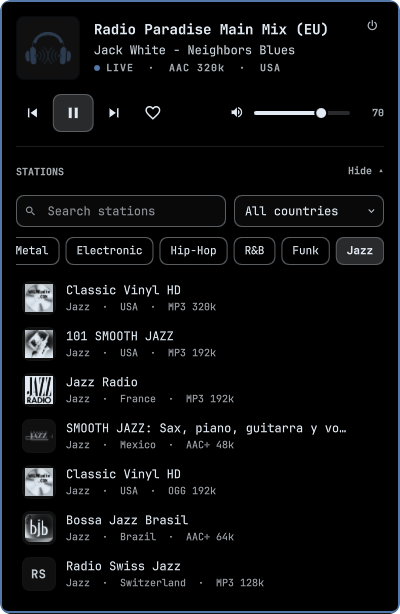
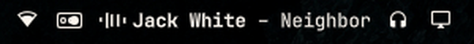
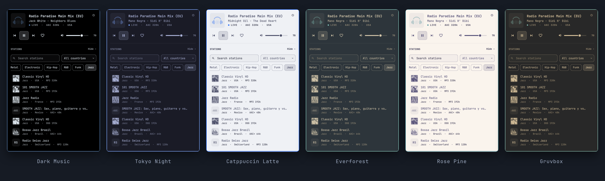
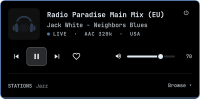
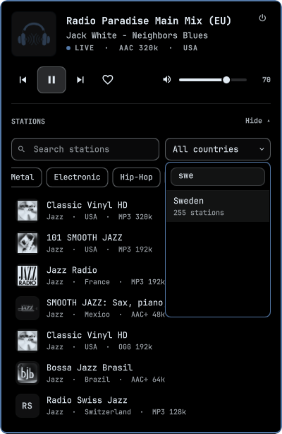

# Hertz Radio for Omarchy

**Radio, beautifully simple — now in your bar.** A minimalist internet-radio
player for the [Omarchy](https://omarchy.org) bar with **50,000+ stations from
240+ countries**. Click the waveform to open the player; press **Browse** to
search stations, pick a genre or country, or open your favorites. Station
artwork is redrawn in your theme's colours, so every logo looks like it belongs
to your desktop.

<p align="center">
  
</p>

Station data comes from the community-run [Radio Browser](https://www.radio-browser.info)
directory.

Hertz Radio is the bar-sized sibling of the Hertz desktop app. It shares
Hertz's genre map and artwork duotone, and follows the active Omarchy theme.

## Features

| | |
|---|---|
| **Now playing in the bar** | **Artist** (bold) and song to the right of the icon while playing (or the station name when the station sends no track info). Long titles scroll left in a gentle loop. Paused or off, only the icon remains. |
| **Player** | Station artwork, live track title, play/pause, previous/next station, favorite and volume. |
| **Browser** | Opens under the player. Search, 28 genres, a country picker (about 240 countries, filterable as you type), favorites, and a list that keeps loading as you scroll, from [Radio Browser](https://www.radio-browser.info). Genre, country and search combine, and the last genre and country are remembered. |
| **Theme aware** | Uses the shell's colours, fonts, spacing and corner rounding. Logos go through a duotone shader: the playing station uses the theme accent, the others use its foreground. |
| **Media keys** | Playback runs in `mpv` with `mpv-mpris`, so media keys and the `omarchy.media` widget work too. |
| **Resilient** | The stream keeps playing across shell restarts. Results are cached when the directory is unreachable, and a failed stream stays selected with a retry button. |
| **Private** | No accounts or tracking. A station's click is reported to Radio Browser only after playback actually starts, the same as the Hertz desktop app. |

## Screenshots

**Now playing in the bar.** The artist is bold, and long titles scroll.

<p align="center"></p>

**Follows your theme.** The same panel in six Omarchy themes. Logos are re-inked
in each theme's colours, and the playing station takes the accent.



<table>
  <tr>
    <td align="center"><br><sub>Just the player</sub></td>
    <td align="center"><br><sub>Country picker, filtered as you type</sub></td>
  </tr>
</table>

## Install

From the [Omarchy plugin marketplace](https://plugins.omarchy.org/), or directly:

```bash
omarchy plugin add https://github.com/PixDevsApps/omarchy-hertz-radio.git --enable
```

While installing, Omarchy asks which part of the bar to put Hertz Radio in:
**left**, **center** or **right** (right is pre-selected). You can also choose
up front, or move it later:

```bash
# Install without the prompt, straight into a section
omarchy plugin add https://github.com/PixDevsApps/omarchy-hertz-radio.git --yes
omarchy plugin enable io.github.pixdevsapps.hertz-radio --section left

# Move it later: left | center | right, optionally next to another widget
omarchy bar move io.github.pixdevsapps.hertz-radio --section center
omarchy bar move io.github.pixdevsapps.hertz-radio --before omarchy.audio
```

Requirements: `python` (standard library only), `mpv` and `mpv-mpris`. All
three ship with Omarchy.

## Using it

| On the bar | |
|---|---|
| Left click | Open or close the player |
| Middle click | Play / pause |
| Right click | Turn the radio off |
| Scroll | Volume |

| In the panel | |
|---|---|
| `Space` | Play / pause |
| `B` | Show or hide the station browser |
| `/` | Search |
| `C` | Choose a country |
| `↑` `↓` / `j` `k` | Move through stations |
| `←` `→` / `h` `l` | Previous / next genre |
| `Enter` | Play the selected station |
| `N` / `P` | Next / previous station |
| `F` | Favorite the selected (or playing) station |
| `+` / `-` | Volume |
| `M` | Mute |
| `S` | Turn the radio off |
| `Esc` | Clear search, then close |

Paused and off both use no bandwidth. **Pause** disconnects the stream and
keeps the station ready, and **Play** rejoins the live broadcast. A pause from
media keys keeps the stream for 10 seconds so a quick resume is instant, then
disconnects too. The **power button** in the player (or a right click on the bar
icon) turns the radio off entirely, shutting down the player process as well.
In both states the bar shows only the icon. Previous and next move through
the list you picked the station from.

### Bar title

The now-playing text can be tuned on the widget's entry in
`~/.config/omarchy/shell.json`:

```json
{ "id": "io.github.pixdevsapps.hertz-radio", "showTitle": true, "maxTitleWidth": 150 }
```

`showTitle: false` shows only the icon. `maxTitleWidth` caps the text width in
pixels, and longer titles scroll. The title is hidden on vertical bars.

To bind the panel to a key, call its IPC target, for example
`omarchy-shell hertz-radio toggle`.

## How it works

```
Panel.qml ──stdin: search / play / toggle / fav / volume …──▶ hertz-ctl daemon (python3)
          ◀─stdout: JSON state, stations, artwork paths──────┘      │
                                   Radio Browser mirrors (failover) ┤
                                   mpv --idle over its IPC socket ──┴──▶ mpv-mpris ──▶ MPRIS
```

- `hertz-ctl` handles the network, the files and the player. The QML only
  renders the snapshots it receives.
- Radio Browser mirrors are discovered from `all.api.radio-browser.info` and
  tried in turn. Responses are size-capped, and only `http(s)` streams are accepted.
- Logos are downloaded once into the cache (size- and type-checked) and tinted
  on the GPU by `shaders/station-tint.frag`. Without a logo, the station's
  initials are shown instead.
- `mpv` runs in its own session. When the shell restarts, the new daemon
  reattaches to the running stream. An idle player is shut down.

## Files it writes

| Path | Contents |
|---|---|
| `~/.local/share/hertz-radio/state.json` | Favorites, volume, last station, genre and country |
| `~/.cache/hertz-radio/` | Station logos and recent result lists |
| `$XDG_RUNTIME_DIR/hertz-radio/` | mpv socket and the current session |

## Remove

```bash
~/.config/omarchy/plugins/io.github.pixdevsapps.hertz-radio/hertz-ctl stop
omarchy plugin remove io.github.pixdevsapps.hertz-radio
```

Removing the plugin keeps your favorites. Delete `~/.local/share/hertz-radio/`
and `~/.cache/hertz-radio/` as well to remove everything.

## Development

```bash
./tools/dev-sync.sh                    # copy into ~/.config/omarchy/plugins and reload
./hertz-ctl search "radio paradise"    # query the directory from the terminal
./hertz-ctl genre Jazz
./hertz-ctl countries                  # ISO codes, station counts and names
/usr/lib/qt6/bin/qsb --qt6 -o shaders/station-tint.frag.qsb shaders/station-tint.frag
```

## Credits

Station data comes from the community [Radio Browser](https://www.radio-browser.info)
directory. Broadcasts and station artwork belong to their owners. The genre map
and artwork shader come from Hertz. MIT licensed.
